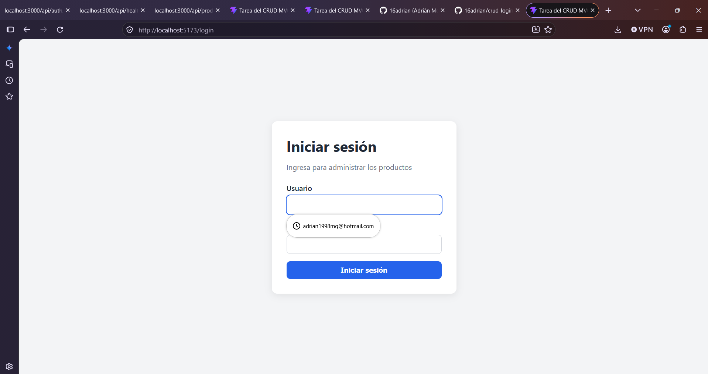
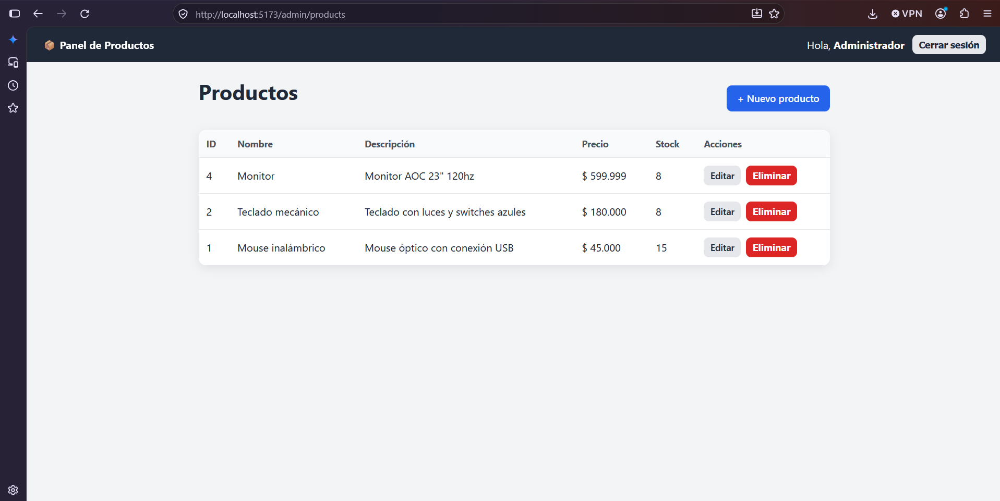
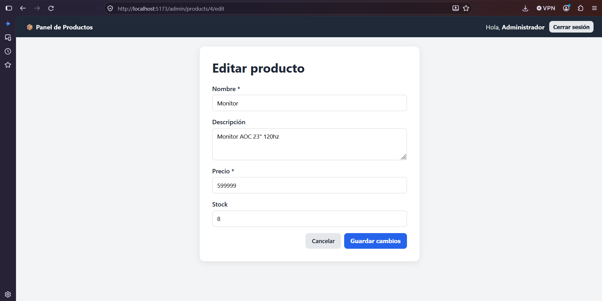
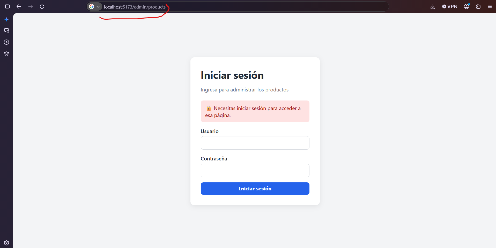

<h1 align="center">🔐 CRUD con Login usando MVC</h1>

<p align="center">
  Aplicación web local con inicio de sesión, rutas protegidas y un CRUD de productos,<br>
  construida con <b>Express.js</b> (backend organizado en MVC) y <b>React</b> (frontend).
</p>

<p align="center">
  
  
  
  
  
  
</p>

---

## Índice

- [Descripción](#descripción)
- [Objetivo](#objetivo)
- [Estado del proyecto](#estado-del-proyecto)
- [Funcionalidades](#funcionalidades)
- [Capturas de pantalla](#capturas-de-pantalla)
- [Tecnologías utilizadas](#tecnologías-utilizadas)
- [Requisitos previos](#requisitos-previos)
- [Instalación y ejecución](#instalación-y-ejecución)
- [Variables de entorno](#variables-de-entorno)
- [Base de datos](#base-de-datos)
- [Usuario de prueba](#usuario-de-prueba)
- [Cómo funciona el Login](#cómo-funciona-el-login)
- [Rutas protegidas](#rutas-protegidas)
- [Cómo funciona el CRUD](#cómo-funciona-el-crud)
- [Endpoints de la API](#endpoints-de-la-api)
- [Arquitectura MVC](#arquitectura-mvc)
- [Estructura del proyecto](#estructura-del-proyecto)
- [Nota de seguridad sobre MD5](#nota-de-seguridad-sobre-md5)
- [Video demostrativo](#video-demostrativo)
- [Autor](#autor)
- [Información adicional](#información-adicional)

---

## Descripción

Este proyecto es una aplicación web que funciona **localmente** y permite:

1. **Iniciar sesión** con usuario y contraseña. Los usuarios se guardan en la tabla `Users` y las contraseñas se almacenan como hash **MD5**.
2. **Administrar productos** (crear, ver, editar y eliminar) en una sección **protegida**, a la que solo se puede entrar después de iniciar sesión.

El **backend** está hecho con **Express.js** y organizado con el patrón **MVC** (Model - View - Controller). El **frontend** está hecho con **React** y se comunica con el backend mediante peticiones HTTP en formato JSON.

## Objetivo

Desarrollar una aplicación con **CRUD y Login** siguiendo el patrón **MVC**, que demuestre:

- Autenticación de usuarios con contraseñas almacenadas en MD5.
- Protección de rutas tanto en el **frontend** como en el **backend**.
- Que una URL protegida copiada **deja de funcionar** después de cerrar sesión.

Proyecto académico de la materia **Ingeniería Web**.

## Estado del proyecto

✅ **Terminado.** Todas las funcionalidades fueron implementadas y probadas localmente.

## Funcionalidades

- 🔐 **Login** con usuario y contraseña, con mensajes de error claros.
- 🚪 **Logout** que destruye la sesión en el servidor.
- 🛡️ **Rutas protegidas** en React (`ProtectedRoute`) y en Express (middleware `requireAuth`).
- ➕ **Crear** productos.
- 📋 **Ver** la lista de productos.
- ✏️ **Editar** productos.
- 🗑️ **Eliminar** productos, con confirmación previa.
- ✅ **Validaciones** en el frontend y en el backend: campos obligatorios, precio numérico y no negativo, stock entero y no negativo.
- 💬 **Mensajes** de éxito (verde) y de error (rojo).
- ↩️ Después de iniciar sesión, el usuario vuelve a la página protegida que intentaba abrir.

## Capturas de pantalla

| Login | Lista de productos |
|---|---|
|  |  |

| Formulario de producto | Acceso sin sesión a una ruta protegida |
|---|---|
|  |  |

## Tecnologías utilizadas

### Backend

| Tecnología | Uso |
|---|---|
| [Node.js](https://nodejs.org/) (LTS) | Entorno para ejecutar JavaScript en la computadora |
| [Express.js](https://expressjs.com/) | Framework del servidor y de las rutas |
| [express-session](https://www.npmjs.com/package/express-session) | Manejo de sesiones con cookies |
| [better-sqlite3](https://www.npmjs.com/package/better-sqlite3) | Conexión con la base de datos SQLite |
| [dotenv](https://www.npmjs.com/package/dotenv) | Lectura de variables de entorno desde `.env` |
| `crypto` (incluido en Node.js) | Generación del hash MD5 |

### Frontend

| Tecnología | Uso |
|---|---|
| [React](https://react.dev/) | Construcción de la interfaz |
| [Vite](https://vite.dev/) | Herramienta para crear y ejecutar el proyecto React (incluye el proxy hacia Express) |
| [React Router](https://reactrouter.com/) (`react-router-dom`) | Navegación entre páginas y rutas protegidas |
| `fetch` (incluido en el navegador) | Peticiones HTTP al backend |

### Base de datos

| Tecnología | Uso |
|---|---|
| [SQLite](https://www.sqlite.org/) | Base de datos local guardada en un solo archivo |

## Requisitos previos

- [Node.js](https://nodejs.org/) versión **LTS** (el proyecto se desarrolló con Node.js 24).
- [Git](https://git-scm.com/) (para clonar el repositorio).
- Un navegador web (Firefox, Chrome, Edge…).

## Instalación y ejecución

> Los comandos están pensados para la terminal **CMD** de Windows.

### 1. Clonar el repositorio

```bash
git clone https://github.com/16adrian/crud-login-mvc.git
cd crud-login-mvc
```

### 2. Preparar y encender el backend

```bash
cd backend
npm install
copy .env.example .env
```

Abre el archivo `backend/.env` y reemplaza el valor de `SESSION_SECRET` por una frase secreta. Puedes generar una con:

```bash
node -e "console.log(require('crypto').randomBytes(32).toString('hex'))"
```

Crea la base de datos (tablas, usuario de prueba y productos de ejemplo):

```bash
npm run db:init
```

Enciende el servidor:

```bash
npm run dev
```

Debe aparecer:

```text
✅ Base de datos conectada (1 usuario(s) registrado(s))
🚀 Servidor encendido en http://localhost:3000
```

### 3. Preparar y encender el frontend

Abre **otra terminal** (el backend debe seguir encendido) desde la carpeta principal del proyecto:

```bash
cd frontend
npm install
npm run dev
```

### 4. Abrir la aplicación

Entra en el navegador a: **http://localhost:5173**

### Scripts disponibles

| Carpeta | Comando | Qué hace |
|---|---|---|
| `backend` | `npm run dev` | Enciende el servidor y lo reinicia al guardar cambios |
| `backend` | `npm start` | Enciende el servidor |
| `backend` | `npm run db:init` | Crea las tablas, el usuario de prueba y los productos de ejemplo |
| `frontend` | `npm run dev` | Enciende React en el puerto 5173 |

## Variables de entorno

El archivo `backend/.env` **no se sube a GitHub** porque contiene información secreta. En su lugar se incluye la plantilla `backend/.env.example`.

| Variable | Descripción | Ejemplo |
|---|---|---|
| `PORT` | Puerto del servidor Express | `3000` |
| `SESSION_SECRET` | Frase secreta para firmar la cookie de sesión | Una cadena larga y aleatoria |

## Base de datos

Se usa **SQLite**: toda la base de datos vive en el archivo `backend/database/database.sqlite`, que se crea con `npm run db:init` y **no se sube a GitHub**. Las tablas están definidas en `backend/database/schema.sql`.

### Tabla `Users`

| Campo | Tipo | Descripción |
|---|---|---|
| `id` | INTEGER, clave primaria, autoincremental | Identificador del usuario |
| `username` | TEXT, obligatorio, único | Nombre de usuario |
| `password` | TEXT, obligatorio | Contraseña guardada como **hash MD5** |
| `full_name` | TEXT, obligatorio | Nombre que se muestra en la aplicación |
| `created_at` | TEXT | Fecha de creación |

### Tabla `Products`

| Campo | Tipo | Descripción |
|---|---|---|
| `id` | INTEGER, clave primaria, autoincremental | Identificador del producto |
| `name` | TEXT, obligatorio | Nombre |
| `description` | TEXT | Descripción |
| `price` | REAL, obligatorio, mayor o igual a 0 | Precio |
| `stock` | INTEGER, mayor o igual a 0 | Unidades disponibles |
| `created_at` / `updated_at` | TEXT | Fechas de creación y última modificación |

### Reiniciar la base de datos

1. Apaga el backend.
2. Borra el archivo `backend/database/database.sqlite`.
3. Ejecuta `npm run db:init` dentro de `backend`.

## Usuario de prueba

| Usuario | Contraseña |
|---|---|
| `admin` | `admin123` |

En la base de datos, la contraseña queda guardada como `0192023a7bbd73250516f069df18b500` (su hash MD5).

## Cómo funciona el Login

1. El usuario escribe su usuario y contraseña en la página `/login` y presiona **Iniciar sesión**.
2. React envía `POST /api/auth/login` con los datos en formato JSON.
3. El proxy de Vite reenvía la petición a Express (puerto 3000).
4. `authController` valida que los campos no estén vacíos.
5. `userModel` busca el usuario en la tabla `Users`.
6. La contraseña escrita se convierte a MD5 (`backend/utils/md5.js`) y se compara con el hash guardado.
7. Si coinciden, se crea una **sesión** en el servidor y el navegador recibe una cookie `sid` (`httpOnly`).
8. React guarda el usuario en `AuthContext` y muestra la sección protegida.
9. Si los datos son incorrectos, el backend responde `401` con el mensaje *"Usuario o contraseña incorrectos."*

**Cerrar sesión:** `POST /api/auth/logout` destruye la sesión en el servidor y borra la cookie.

## Rutas protegidas

La protección se implementa en **dos niveles**:

| Nivel | Archivo | Qué hace |
|---|---|---|
| Frontend | `frontend/src/components/ProtectedRoute.jsx` | Si no hay sesión, redirige a `/login` con el mensaje *"Necesitas iniciar sesión para acceder a esa página."* |
| Backend | `backend/middlewares/requireAuth.js` | Si la petición no tiene una sesión válida, responde `401` y no entrega datos |

La protección del frontend mejora la experiencia del usuario; **la seguridad real está en el backend**, que no entrega información sin una sesión válida.

**Rutas del frontend:**

| Ruta | Acceso |
|---|---|
| `/login` | Pública |
| `/admin/products` | 🔒 Protegida |
| `/admin/products/new` | 🔒 Protegida |
| `/admin/products/:id/edit` | 🔒 Protegida |

**¿Por qué una URL copiada deja de funcionar después de cerrar sesión?** Porque la URL no da acceso por sí misma: el acceso depende de la sesión del servidor. Al cerrar sesión, la sesión se destruye; al pegar la URL, React consulta `GET /api/auth/me`, el backend responde `401` y la aplicación redirige al Login.

## Cómo funciona el CRUD

| Operación | En la aplicación | Petición al backend |
|---|---|---|
| **Create** | Botón **+ Nuevo producto** → formulario → **Crear producto** | `POST /api/products` |
| **Read** | Tabla de la pantalla de productos | `GET /api/products` |
| **Update** | Botón **Editar** → formulario con los datos → **Guardar cambios** | `PUT /api/products/:id` |
| **Delete** | Botón **Eliminar** → confirmación | `DELETE /api/products/:id` |

**Validaciones** (en React y nuevamente en Express):

- El nombre es obligatorio.
- El precio es obligatorio, debe ser un número y no puede ser negativo.
- El stock es opcional (si se deja vacío vale 0), debe ser un número entero y no puede ser negativo.

## Endpoints de la API

| Método | Ruta | Descripción | ¿Requiere sesión? |
|---|---|---|---|
| `GET` | `/api/health` | Comprueba que el backend funciona | No |
| `POST` | `/api/auth/login` | Inicia sesión | No |
| `POST` | `/api/auth/logout` | Cierra sesión | No |
| `GET` | `/api/auth/me` | Devuelve el usuario de la sesión actual | 🔒 Sí |
| `GET` | `/api/products` | Lista todos los productos | 🔒 Sí |
| `GET` | `/api/products/:id` | Obtiene un producto | 🔒 Sí |
| `POST` | `/api/products` | Crea un producto | 🔒 Sí |
| `PUT` | `/api/products/:id` | Actualiza un producto | 🔒 Sí |
| `DELETE` | `/api/products/:id` | Elimina un producto | 🔒 Sí |

**Códigos de respuesta usados:** `200` (correcto), `201` (creado), `400` (datos inválidos), `401` (no autenticado), `404` (no encontrado), `500` (error del servidor).

## Arquitectura MVC

```text
React (View)
   ↓  petición HTTP (JSON)
Express → Route → Middleware (requireAuth) → Controller → Model → SQLite
   ↑                                                              │
   └──────────────────── respuesta JSON ──────────────────────────┘
```

| Capa | Carpeta | Responsabilidad |
|---|---|---|
| **Model** | `backend/models/` | Único lugar que consulta la base de datos (SQL) |
| **View** | `frontend/` (React) | Lo que ve el usuario. Express solo responde datos en JSON |
| **Controller** | `backend/controllers/` | Valida los datos, usa el Model y arma la respuesta |
| **Route** | `backend/routes/` | Asocia cada URL y método HTTP con una función del Controller |
| **Middleware** | `backend/middlewares/` | Revisa la petición antes del Controller (sesión) y maneja los errores |

## Estructura del proyecto

```text
crud-login-mvc/
├── backend/
│   ├── controllers/
│   │   ├── authController.js     # Login, logout y "¿quién soy?"
│   │   └── productController.js  # CRUD de productos + validaciones
│   ├── database/
│   │   ├── db.js                 # Conexión con SQLite
│   │   ├── init.js               # Crea el usuario de prueba y productos de ejemplo
│   │   └── schema.sql            # Definición de las tablas
│   ├── middlewares/
│   │   ├── errorHandler.js       # Errores 404 y 500
│   │   └── requireAuth.js        # Protege las rutas (exige sesión)
│   ├── models/
│   │   ├── productModel.js       # SQL de la tabla Products
│   │   └── userModel.js          # SQL de la tabla Users
│   ├── routes/
│   │   ├── authRoutes.js         # /api/auth/...
│   │   └── productRoutes.js      # /api/products/... (protegidas)
│   ├── utils/
│   │   └── md5.js                # Hash MD5 de las contraseñas
│   ├── .env.example              # Plantilla de variables de entorno
│   ├── app.js                    # Configura Express (sesión, rutas, errores)
│   ├── server.js                 # Enciende el servidor
│   └── package.json
├── frontend/
│   ├── public/
│   ├── src/
│   │   ├── components/
│   │   │   ├── Navbar.jsx            # Barra con usuario y "Cerrar sesión"
│   │   │   └── ProtectedRoute.jsx    # Protege las páginas en React
│   │   ├── context/
│   │   │   └── AuthContext.jsx       # Estado de la sesión compartido
│   │   ├── pages/
│   │   │   ├── LoginPage.jsx         # Pantalla de login
│   │   │   ├── ProductsPage.jsx      # Lista de productos (Read y Delete)
│   │   │   └── ProductFormPage.jsx   # Formulario (Create y Update)
│   │   ├── services/
│   │   │   └── api.js                # Peticiones HTTP al backend
│   │   ├── App.jsx                   # Mapa de rutas
│   │   ├── index.css                 # Estilos
│   │   └── main.jsx                  # Punto de arranque de React
│   ├── index.html
│   ├── vite.config.js                # Proxy /api → http://localhost:3000
│   └── package.json
├── docs/
│   └── capturas/                     # Capturas de pantalla del README
├── .gitignore
└── README.md
```

## Nota de seguridad sobre MD5

La tarea solicita expresamente almacenar las contraseñas con **MD5**, y así se implementó (`backend/utils/md5.js`).

Sin embargo, **MD5 no se recomienda para contraseñas en sistemas reales**: es un algoritmo muy rápido, lo que permite probar miles de millones de combinaciones por segundo, y existen tablas públicas con los hashes de contraseñas comunes. En aplicaciones reales se deben usar algoritmos diseñados para contraseñas, como **bcrypt** o **Argon2**, que son lentos a propósito y usan una "sal" distinta para cada usuario.

## Video demostrativo

Video de demostración del funcionamiento del proyecto:

[](https://www.youtube.com/watch?v=uy3BjAGAi3M)

▶️ **Enlace:** https://www.youtube.com/watch?v=uy3BjAGAi3M

## Autor

| [<br><sub>Adrián Morales Quilumba</sub>](https://github.com/16adrian) |
|:---:|

## Información adicional

- Proyecto académico de la materia **Ingeniería Web**, desarrollado únicamente para ejecución **local**.
- Las sesiones se guardan en la memoria del servidor: si el backend se reinicia, es necesario volver a iniciar sesión.
- No se suben a GitHub: `node_modules/`, `.env` ni la base de datos `database.sqlite` (ver `.gitignore`).
